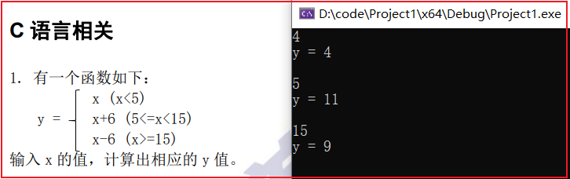
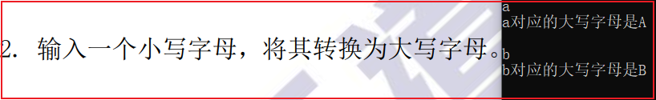
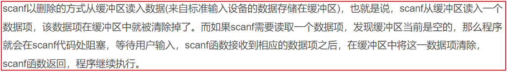
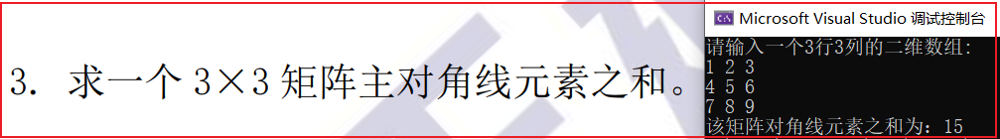
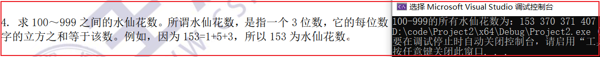

# 基础60题

## 第一题

```c++
#define _CRT_SECURE_NO_WARNINGS//解决在vs2022中scanf不安全的问题
#include <stdio.h>

int func(int x) {
	if (x < 5) {
		return x;
	}
	else if (x >= 5 && x < 15){
		return x + 6;
	}
	else {
		return x - 6;
	}
}

int main() {

	int x;

	while (scanf("%d", &x) != EOF){		//输入x的值
		printf("y = %d\n\n", func(x));	//通过函数计算y的值并输出
	}
	
	return 0;
}
```

- 运行结果

  

- 收获
  - 用`while (scanf("%d", &x) != EOF)`这种方式实现无限读入，但是`scanf`会涉及缓冲区问题，后面可能有坑
  - `#define _CRT_SECURE_NO_WARNINGS`加一行宏定义解决`scanf`在vs中的不安全问题

## 第二题

```c++
#define _CRT_SECURE_NO_WARNINGS//解决在vs2022中scanf不安全的问题
#include <stdio.h>

char func(char c) {
	return c - 32;
}

int main() {

	char c;

	while (scanf("%c", &c) != EOF) {				  //输入小写字母 
		getchar();									//读出每次缓冲区的换行
		printf("%c对应的大写字母是%c\n\n", c, func(c));	 //通过函数转换为大写字母并输出
	}
	return 0;
}
```

- 运行结果



- 收获

  - 解决了`vs2022`控制台输出中文乱码的问题，但是设置的编码格式是简体中文936，**后面不知道会不会出问题**
  
  - 了解了`scanf`缓冲区机制（这里其实算一个大坑）
    - 特别是使用`scanf`读取单个字符时需要特别注意，因为这里不会忽略前导空白符（c语言的前导空白符一般包括：空格符，制表符，换行符）
    - 
      - 这里可以联想到408的读者写者问题

  - 用`while (scanf("%c", &c) != EOF)`这种方式实现一个个循环读取字符时确实有坑，因为在这里`scanf`读取的是字符，在控制台输入的换行也会随之读入，造成输出结果和预期不符合

    - 解决办法：用`getchar()`函数把每一次输入的换行符读掉即可，谨慎用`scanf(" ");`代替`getchar()`会有意想不到的结果

    - 不好的解决办法
  
      ```cc
      while (scanf(" %c", &c) != EOF) {				   //输入小写字母 
      	getchar();									//读出每次缓冲区的换行
      	printf("%c对应的大写字母是%c\n\n", c, func(c));	//通过函数转换为大写字母并输出
      }
      ```
  
      - 这种方法在`scanf()`中加一个空格，可读性太差，属实是自己坑自己

- 参考：https://blog.csdn.net/u011499425/article/details/52606973

## 第三题

```c++
#define _CRT_SECURE_NO_WARNINGS//解决在vs2022中scanf不安全的问题
#include <stdio.h>

const int N = 3;

int func(int (*a)[N]) {

	int temp = 0;
	for (int i = 0; i < N; ++i) {
		for (int j = 0; j < N; ++j) {
			if (i == j) {
				temp += a[i][j];//筛选出对角线元素，进行相加
			}
		}
	}
	return temp;
}
int main() {

	int a[N][N];

	printf("请输入一个%d行%d列的二维数组:\n", N, N);

	for (int i = 0; i < N; ++i) {
		for (int j = 0; j < N; ++j) {
			scanf("%d", &a[i][j]);//注意这里不要忘记加取地址符号
		}
	}
	//a是二维数组的首地址
	//其实可以理解为指向一片连续的区域，这片连续的区域
	// 逻辑上是二维的，实际上也是一维进行存储的
	int ans = func(a);
					  
	printf("该矩阵对角线元素之和为：%d", ans);
	return 0;
}
```

- 运行结果



- 收获
  - 复习了一维数组和二维数组作为函数的参数问题
  - 简单理解，不管是一维数组和二维数组，**数组的名字都是一个地址**，不用搞那么复杂，就是指向一片连续空间的地址，只不过一维数组名用一位的角度去解释这篇连续的地址空间，二维数组名用二维的角度去解释这片连续的空间（二维数组以及更高维度的数组，都是逻辑上是高维的，实际存放还是一维度的）
  - 有关形参的书写
    - 实参是`int`型一维数组名，则形参为`int *a` 或者`int a[]`，有时根据需要，还需要把数组长度进行传递
    - 实参是`int`型二维数组名，则形参为`int (*a)[对应数组的列标最大值]`或者`int a[][对应数组的列标最大值]`（因为二维数组默认是按行存储的，必须指明列这个维度，才能结合数组名去存取数据）
- 参考：https://www.cnblogs.com/Anker/archive/2013/03/09/2951878.html

## 第四题

```c++
#define _CRT_SECURE_NO_WARNINGS//解决在vs2022中scanf不安全的问题
#include <stdio.h>

int main() {

	printf("100-999的所有水仙花数为：");
	for (int i = 100; i <= 999; ++i) {
		int bw = i / 100 % 10;//获取三位数的百位
		int sw = i / 10 % 10; //获取三位数的十位
		int gw = i % 10;	  //获取三位数的各位
		if (bw * bw * bw + sw * sw * sw + gw * gw * gw == i) {
			printf("%d ", i);
		}
	}
	
	return 0;
}
```

- 运行结果

- 收获
  - 就是暴力搜索+条件筛选，关键是利用c语言的除法和去模运算把数字一位位的拆开