# 基础60题

## c语言

### 第一题

```c++
#define _CRT_SECURE_NO_WARNINGS//解决在vs2022中scanf不安全的问题
#include <stdio.h>

int func(int x) {
	if (x < 5) {
		return x;
	}
	else if (x >= 5 && x < 15){
		return x + 6;
	}
	else {
		return x - 6;
	}
}

int main() {

	int x;

	while (scanf("%d", &x) != EOF){		//输入x的值
		printf("y = %d\n\n", func(x));	//通过函数计算y的值并输出
	}
	
	return 0;
}
```

- 运行结果

  

- 收获
  - 用`while (scanf("%d", &x) != EOF)`这种方式实现无限读入，但是`scanf`会涉及缓冲区问题，后面可能有坑
  - `#define _CRT_SECURE_NO_WARNINGS`加一行宏定义解决`scanf`在vs中的不安全问题

### 第二题

```c++
#define _CRT_SECURE_NO_WARNINGS//解决在vs2022中scanf不安全的问题
#include <stdio.h>

char func(char c) {
	return c - 32;
}

int main() {

	char c;

	while (scanf("%c", &c) != EOF) {				  //输入小写字母 
		getchar();									//读出每次缓冲区的换行
		printf("%c对应的大写字母是%c\n\n", c, func(c));	 //通过函数转换为大写字母并输出
	}
	return 0;
}
```

- 运行结果


- 收获

  - 解决了`vs2022`控制台输出中文乱码的问题，但是设置的编码格式是简体中文936，**后面不知道会不会出问题**
  
  - 了解了`scanf`缓冲区机制（这里其实算一个大坑）
    - 特别是使用`scanf`读取单个字符时需要特别注意，因为这里不会忽略前导空白符（c语言的前导空白符一般包括：空格符，制表符，换行符）
    - 
      - 这里可以联想到408的读者写者问题

  - 用`while (scanf("%c", &c) != EOF)`这种方式实现一个个循环读取字符时确实有坑，因为在这里`scanf`读取的是字符，在控制台输入的换行也会随之读入，造成输出结果和预期不符合

    - 解决办法：用`getchar()`函数把每一次输入的换行符读掉即可，谨慎用`scanf(" ");`代替`getchar()`会有意想不到的结果

    - 不好的解决办法
  
      ```cc
      while (scanf(" %c", &c) != EOF) {				   //输入小写字母 
      	getchar();									//读出每次缓冲区的换行
      	printf("%c对应的大写字母是%c\n\n", c, func(c));	//通过函数转换为大写字母并输出
      }
      ```
  
      - 这种方法在`scanf()`中加一个空格，可读性太差，属实是自己坑自己

- 参考：https://blog.csdn.net/u011499425/article/details/52606973

### 第三题

```c++
#define _CRT_SECURE_NO_WARNINGS//解决在vs2022中scanf不安全的问题
#include <stdio.h>

const int N = 3;

int func(int (*a)[N]) {

	int temp = 0;
	for (int i = 0; i < N; ++i) {
		for (int j = 0; j < N; ++j) {
			if (i == j) {
				temp += a[i][j];//筛选出对角线元素，进行相加
			}
		}
	}
	return temp;
}
int main() {

	int a[N][N];

	printf("请输入一个%d行%d列的二维数组:\n", N, N);

	for (int i = 0; i < N; ++i) {
		for (int j = 0; j < N; ++j) {
			scanf("%d", &a[i][j]);//注意这里不要忘记加取地址符号
		}
	}
	//a是二维数组的首地址
	//其实可以理解为指向一片连续的区域，这片连续的区域
	// 逻辑上是二维的，实际上也是一维进行存储的
	int ans = func(a);
					  
	printf("该矩阵对角线元素之和为：%d", ans);
	return 0;
}
```

- 运行结果


- 收获
  - 复习了一维数组和二维数组作为函数的参数问题
  - 简单理解，不管是一维数组和二维数组，**数组的名字都是一个地址**，不用搞那么复杂，就是指向一片连续空间的地址，只不过一维数组名用一位的角度去解释这篇连续的地址空间，二维数组名用二维的角度去解释这片连续的空间（二维数组以及更高维度的数组，都是逻辑上是高维的，实际存放还是一维度的）
  - 有关形参的书写
    - 实参是`int`型一维数组名，则形参为`int *a` 或者`int a[]`，有时根据需要，还需要把数组长度进行传递
    - 实参是`int`型二维数组名，则形参为`int (*a)[对应数组的列标最大值]`或者`int a[][对应数组的列标最大值]`（因为二维数组默认是按行存储的，必须指明列这个维度，才能结合数组名去存取数据）
- 参考：https://www.cnblogs.com/Anker/archive/2013/03/09/2951878.html

### 第四题

```c++
#define _CRT_SECURE_NO_WARNINGS//解决在vs2022中scanf不安全的问题
#include <stdio.h>

int main() {

	printf("100-999的所有水仙花数为：");
	for (int i = 100; i <= 999; ++i) {
		int bw = i / 100 % 10;//获取三位数的百位
		int sw = i / 10 % 10; //获取三位数的十位
		int gw = i % 10;	  //获取三位数的各位
		if (bw * bw * bw + sw * sw * sw + gw * gw * gw == i) {
			printf("%d ", i);
		}
	}
	
	return 0;
}
```

- 运行结果

- 收获
  - 就是暴力搜索+条件筛选，关键是利用c语言的除法和去模运算把数字一位位的拆开

### 第五题

```c++
#define _CRT_SECURE_NO_WARNINGS//解决在vs2022中scanf不安全的问题
#include <stdio.h>

int main() {

	printf("请输入百分制成绩：");
	
	int score = 0;
	while (scanf("%d", &score) != EOF) {
		if (score >= 90 && score <= 100) {
			printf("%d对应的等级为A(优秀)\n\n", score);
		}
		else if (score >= 80 && score <= 89) {
			printf("%d对应的等级为B(良好)\n\n", score);
		}
		else if (score >= 70 && score <= 79) {
			printf("%d对应的等级为C(中等)\n\n", score);
		}
		else if (score >= 60 && score <= 69) {
			printf("%d对应的等级为D(合格)\n\n", score);
		}
		else {
			printf("该成绩不合格\n\n");
		}
		printf("请输入百分制成绩：");
	}
	
	return 0;
}
```

- 运行结果

  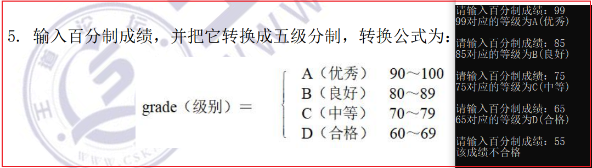

- 收获
  - 就是分支结构，顺便复习了`switch`分支结构，不过`switch`结构不常用

### 第六题

```c++
#define _CRT_SECURE_NO_WARNINGS//解决在vs2022中scanf不安全的问题
#include <stdio.h>

int func(int num) {
	
	if (num == 0) {
		return 1;
	}
	else if (num == 1) {
		return 1;
	}
	else {
		int temp1 = 1;
		int temp2 = 1;
		int temp3 = 0;
		for (int i = 2; i <= num; ++i) {
			temp3 = temp1 + temp2;
			temp1 = temp2;
			temp2 = temp3;
		}
		return temp3;
	}
}

int main() {

	int num;
	printf("请输入斐波那契的项数：");

	while (scanf("%d", &num) != EOF) {
		
		printf("第%d项对应的斐波那契为：%d\n\n", num, func(num));

		printf("请输入斐波那契的项数：");
	}

	return 0;
}
```

- 运行结果

  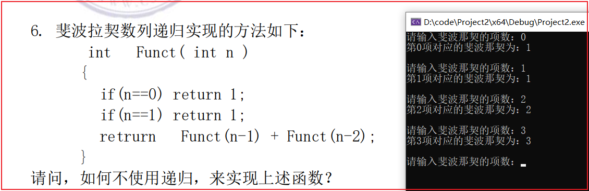

- 收获
  - 回顾了常见的三种斐波那契的解决方法
    - 利用递归
      - 优点：代码简洁，容易书写
      - 缺点：项数不易过大，否则可能爆栈，且没有记忆功能
    - 利用循环迭代交替变量
      - 优点：时间复杂度和空间复杂度都是非常低的
      - 缺点：代码不易输出，代码可读性较差，且没有记忆功能
    - 利用数组记忆
      - 优点：代码非常容易书写，而且非常容易理解
      - 缺点：因为要用数组记录每一项的结果，所以空间复杂度较差

### 第七题

```c++
#define _CRT_SECURE_NO_WARNINGS//解决在vs2022中scanf不安全的问题
#include <stdio.h>
#include <stdlib.h>

const int N = 100;
void reverse(int a[], int length) {

	//第一个和最后一个元素进行交换，交换到数据长度一半的位置即可
	for (int i = 0; i < length / 2; i++){
		int temp = a[i];
		a[i] = a[length - i - 1];
		a[length - i - 1] = temp;
	}
}

int main() {

	int length;
	int a[N];

	printf("请输入数组的长度(大于等于1并且小于等于100)：");
	scanf("%d", &length);

	printf("\n请输入长度为%d的数组：", length);

	for (int i = 0; i < length; i++){
		scanf("%d", &a[i]);
	}
	reverse(a, length);

	printf("\n数组逆序的结果为：");
	for (int i = 0; i < length; i++){
		printf("%d ", a[i]);
	}
	return 0;
}
```

- 运行结果

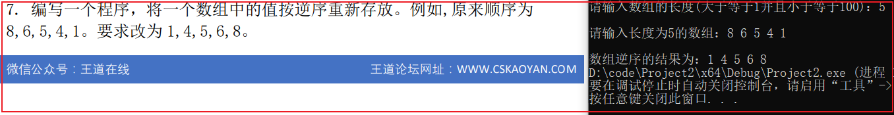

- 收获
  - 回顾了用用三个变量交换数据的操作，认识到了，数组名是一个地址，和普通的函数值传递是不同的
  - 数组名作为参数进行传递，通常数组的长度也要一起传递，便于操作

### 第八题

```c++
#define _CRT_SECURE_NO_WARNINGS//解决在vs2022中scanf不安全的问题
#include <stdio.h>
#include <stdlib.h>
#include <math.h>

int main() {

	double a = 0, b = 0, c = 0;
	printf("请输入三角形的三条边长：");
	while (scanf("%lf%lf%lf", &a, &b, &c) != EOF){
		//判断三条边能否构成三角形
		if (a + b > c && a + c > b && b + c > a) {
			
			//根据海伦公式计算三角形的面积
			double s = (a + b + c) / 2;//三角形的半周长
			double area = sqrt(s * (s - a) * (s - b) * (s - c));

			printf("该三角形的面积为：%.2lf\n", area);

			//判断三角形的类型
			if (a == b && b == c && a == c) {
				printf("该三角形的类型为等边三角形\n\n");
			}
			else if (a == b || a == c || b == c ) {
				printf("该三角形的类型为等腰三角形\n\n");
			}
			else if (a * a + b * b == c * c || a * a + c * c == b * b ||
				b * b + c * c == a * a){
				printf("该三角形的类型为直角三角形\n\n");
			}
			else {
				printf("该三角形是普通三角形\n\n");
			}

		}
		else {
			printf("上述三条边不能构成三角形\n");
		}
		printf("\n请输入三角形的三条边长：");
	}

	return 0;
}
```

- 运行结果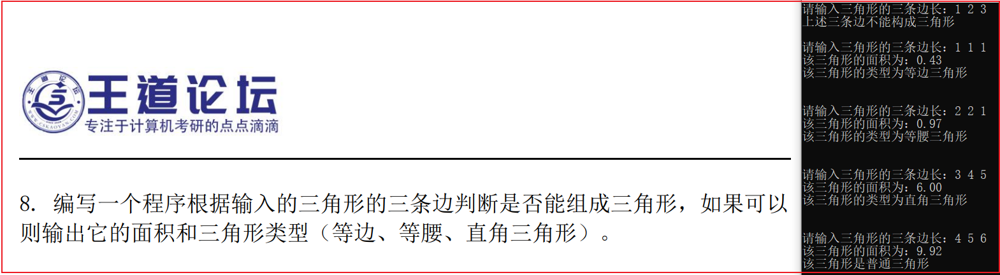

- 收获
  - 复习了三角形有关的知识 以及c语言的逻辑运算
    - 已知三边长度如何判断能否构成三角形
    - 直接利用三角形三条边计算三角形的面积
    - 判断三角形的类型（主要用到逻辑运算）

### 第九题

```c++
#define _CRT_SECURE_NO_WARNINGS//解决在vs2022中scanf不安全的问题
#include <stdio.h>
#include <limits.h>            //定义常量来表示数据的最大值最小值

int main() {

	printf("请输入若干个学生的成绩（输入负数结束）：");
	
	int temp = 0;
	int max = INT_MIN, min = INT_MAX;

	while (scanf("%d", &temp) != EOF && temp >= 0) {
		//更新最大值
		if (temp > max) {
			max = temp;
		}
		//更新最小值
		if (temp < min) {
			min = temp;
		}
	}
	printf("最高成绩为：%d\n", max);
	printf("最低成绩为：%d\n", min);

	return 0;
}
```

- 运行结果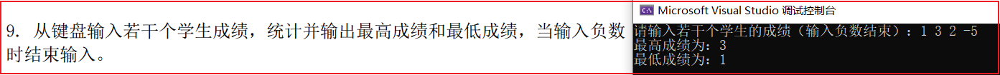

- 收获
  - 循环条件中结合逻辑运算可以简化代码的书写
  - 编译器有时候也会出错，要相信自己，关闭重开`IDE`重新尝试

### 第十题

```c++
#define _CRT_SECURE_NO_WARNINGS//解决在vs2022中scanf不安全的问题
#include <stdio.h>

double func(double F) {
	double C = (F - 32) * 5 / 9;
	return C;
}

int main() {

	double F;
	printf("请输入一个华氏温度：");
	scanf("%lf", &F);

	double C = func(F);
	printf("该华氏温度对应的摄氏温度为：%.2lf\n", C);
	
	return 0;
}
```

- 运行结果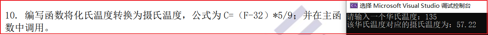

- 收获
  - 复习函数的调用，数据类型的选择

### 第十一题

```c++
#define _CRT_SECURE_NO_WARNINGS//解决在vs2022中scanf不安全的问题
#include <stdio.h>

int main() {

	int num;
	printf("请输入一个自然数：");
	scanf("%d", &num);
	printf("%d=1", num);
	
	int i = 2;
	int j = i;

	while (num != 1){
		j = i;
		if (num % j == 0) {
			num /= j;
			printf("*%d", j);
		}
		else{
			++i;
		}
	}
	
	return 0;
}
```

- 运行结果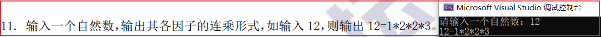

- 收获
  - 其实这题逻辑性还挺强的，凭感觉写出来的，这里的思想是，从2开始进行暴力搜索，下一次再次尝试上一次的因子能否被整除，如果可以那么继续用上一次的因子，如果不行，那么用上一次的因子+1进行尝试
  - 大多情况下，`for`循环比较好用，但是有些情况下`while`循环更简洁好用

### 第十二题

```c++
#define _CRT_SECURE_NO_WARNINGS//解决在vs2022中scanf不安全的问题
#include <stdio.h>

const int N = 5;

int FindIndex(int* a, int num) {

	int i = 0;
	for (i; i < N - 1; i++) {
		if (a[i] > num) {
			break;
		}
	}
	return i;
}

void Insert(int* a, int index, int num) {
	//循环后移，进行插入
	for (int i = N - 1; i > index; i--) {
		a[i] = a[i - 1];
	}
	a[index] = num;
}

int main() {

	int a[N];
	printf("请从小到大输入%d个数：", N - 1);
	for (int i = 0; i < N - 1; ++i) {
		scanf("%d", &a[i]);
	}

	int temp = 0;
	printf("\n请输入要插入的数字：");
	scanf("%d", &temp);

	//找到待插入位置
	int index = FindIndex(a, temp);

	//进行插入
	Insert(a, index, temp);

	printf("\n插入后的新数列为：");
	for (int i = 0; i < N; ++i) {
		printf("%d ", a[i]);
	}

	return 0;
}
```

- 运行结果

  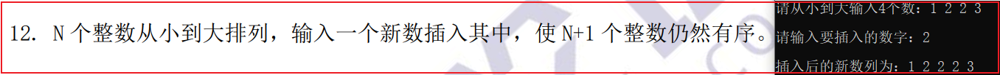

- 收获
  - 感受c语言，过程解决问题的思想：这里借助数组存放，首先，查找到数据待插入的位置；然后，从数组最后一个位置循环后移，直到待插入位置；最后，进行把当前数据进行插入

### 第十三题

```c++
#define _CRT_SECURE_NO_WARNINGS//解决在vs2022中scanf不安全的问题
#include <stdio.h>

int main() {

	for (int i = 100; i <= 200; ++i) {
		if (i % 3 == 2 && i % 5 == 3 && i % 7 == 2) {
			printf("%d", i);
		}
	}

	return 0;
}
```

- 运行结果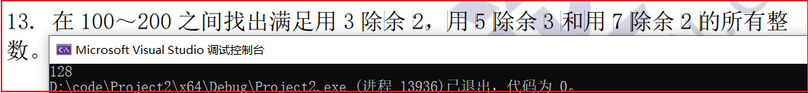

- 收获
  - 利用循环，进行条件筛选即可

### 第十四题

```c++
#define _CRT_SECURE_NO_WARNINGS//解决在vs2022中scanf不安全的问题
#include <stdio.h>

int main() {

	double temp = 0;
	double sum = 0;
	int sum1 = 0, sum2 = 0;
	printf("请输入10个同学的成绩（百分制）：");

	for (int i = 0; i < 10; ++i){
		scanf("%lf", &temp);
		if (temp > 80) {
			++sum1;
		}
		if (temp < 60) {
			++sum2;
		}
		sum += temp;
	}
	printf("80分以上的人数为：%d\n", sum1);
	printf("不及格的人数为：%d\n", sum2);
	printf("平均分为：%.2lf\n", sum / 10);

	return 0;
}
```

- 运行结果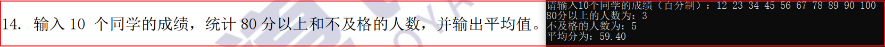

- 收获
  - 同样是利用循环结合条件筛选统计解决问题，但是要注意，不同问题数据类型的选择

### 第十五题

```c++
#define _CRT_SECURE_NO_WARNINGS//解决在vs2022中scanf不安全的问题
#include <stdio.h>

int main() {

	char c;
	printf("请输入一个字符：");
	while (scanf("%c", &c) != EOF){
		
		getchar();//把换行从缓冲区中读出

		if (c >= 97 && c <= 122) {
			printf("该字符是小写英文字母\n\n");
		}
		else if (c >= 65 && c <= 90) {
			printf("该字符是大写英文字母\n\n");
		}
		else {
			printf("该字符不是英文字母\n\n");
		}
		printf("请输入一个字符：");
	}
	
	return 0;
}
```

- 运行结果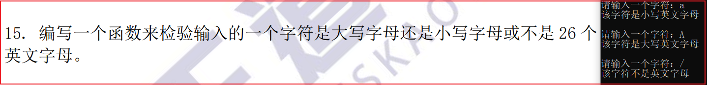

- 收获
  - 在c语言，一个字符对应一个唯一的`ASCALL`码，本题可以根据字符所对应的`ASCALL`码来解决问题
  - 用`scanf()`输入字符时，要特别注意，见第二题（因为`scanf`对字符的时候，换行符不会忽略）

### 第十六题

```c++
#define _CRT_SECURE_NO_WARNINGS//解决在vs2022中scanf不安全的问题
#include <stdio.h>

int main() {

	double r = 0, h = 0;
	printf("请输入圆柱体的半径和高：");
	scanf("%lf%lf", &r, &h);

	double s = 0, v = 0;
	s = 3.14 * r * r;
	v = s * h;

	printf("该圆柱体的底面积为：%.2lf\n", s);
	printf("该圆柱体的体积为：%.2lf\n", v);
	
	return 0;
}
```

- 运行结果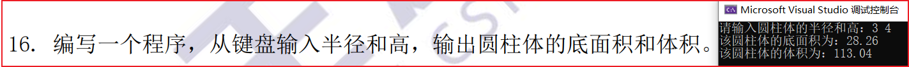

- 收获
  - 注意输入输出格式即可

### 第十七题

***

#### 方法一

- 利用字符数组存放输入的字符串进行解决

```c++
#define _CRT_SECURE_NO_WARNINGS//解决在vs2022中scanf不安全的问题
#include <stdio.h>

int main() {

	char p[100];
	printf("请输入一行字符串：");
	fgets(p, sizeof(p), stdin);//用fgets函数，从标准输入中，读取字符串

	int sum1 = 0, sum2 = 0, sum3 = 0, sum4 = 0;

	for (int i = 0; p[i] != '\0'; i++){
		if ((p[i] >= 97 && p[i] <= 122) || (p[i] >= 65 && p[i] <= 90)) {
			sum1++;
		}
		else if (p[i] == 32) {
			sum2++;
		}
		else if (p[i] >= 48 && p[i] <= 57) {
			sum3++;
		}
		else {
			sum4++;
		}
	}

	printf("英文字母的个数为：%d\n", sum1);
	printf("空格的个数为：%d\n", sum2);
	printf("数字的个数为：%d\n", sum3);

	//这里sum4 - 1 是因为fgets从标准读入时，最后输入的换行符也会读入
	printf("其他字符的个数为：%d\n", sum4 - 1);

	return 0;
}
```

- 运行结果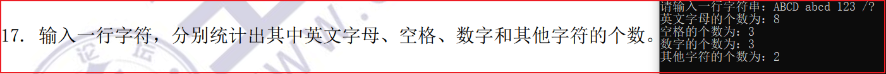

#### 方法二

- 利用`scanf`函数的缓存机制，只定义一个字符变量进行解决

```c++
#define _CRT_SECURE_NO_WARNINGS//解决在vs2022中scanf不安全的问题
#include <stdio.h>
#include <math.h>

int main() {

	printf("请输入一行字符串：");

	int sum1 = 0, sum2 = 0, sum3 = 0, sum4 = 0;
	
	char c;
	while (scanf("%c", &c) != EOF && c != 10){
		if ((c >= 97 && c <= 122) || (c >= 65 && c <= 90)) {
			sum1++;
		}
		else if (c == 32) {
			sum2++;
		}
		else if (c >= 48 && c <= 57) {
			sum3++;
		}
		else {
			sum4++;
		}
	}

	printf("英文字母的个数为：%d\n", sum1);
	printf("空格的个数为：%d\n", sum2);
	printf("数字的个数为：%d\n", sum3);
	printf("其他字符的个数为：%d\n", sum4);

	return 0;
}
```

- 运行结果

  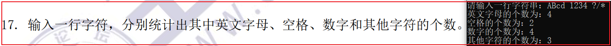

- 最终收获

  - 复习c语言中，两种存放字符串的方式，**注意这两种方式，赋值都会默认在字符串末尾添加`'\0'`作为该字符串结束的标志**
    - 利用字符指针：只能对字符串进行读，不能修改和再次写入
    - 利用字符数组：能读能写
  - `const char *p = "c++";`联想到指针常量和常量指针
    - `const`修饰指针 `const int *p=&a;`常量指针，指针指向的值不能改，指针的指向可以改
    - `const`修饰常量 `int *const p=&a;`指针常量，指针的指向不能改，指针指向的值可以改
    - `const int * const p=&a;`都不能改

  - **注意不能用`scanf`读取带有空格的字符串**，这样只会读到带有空格字符串的第一个单词（原因：当用`scnaf("%s")`这种方式读取字符串时，遇到空格，制表符，换行符就会停止，然后在字符串最后面添加一个'\0'作为这个字符串结束的标志）
    - 解决方法，用`fgets`函数进行读取，但是`fgets`函数，会把**最后输入的换行符也会读入**，这一点要注意
    - 补充：可以用gets函数进行读取，且最后一个换行符会被舍弃，相较于fgets函数更简便

- 参考

  - https://blog.51cto.com/u_15127582/2834687
  - https://blog.csdn.net/qq_35212671/article/details/53440439

### 第十八题

```c++
#define _CRT_SECURE_NO_WARNINGS//解决在vs2022中scanf不安全的问题
#include <stdio.h>

const int N = 5;//定义常量

int main() {

	int a[N][N];

	for (int i = 0; i < N; ++i) {
		for (int j = 0; j < N; ++j){
			if (i <= j) {
				a[i][j] = 1;
			}
			else {
				a[i][j] = i + 1 - j;
			}
			printf("%d ", a[i][j]);
		}
		printf("\n");
	}

	return 0;
}
```

- 运行结果

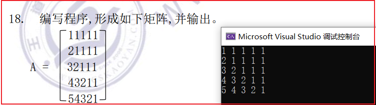

- 收获
  - 找到数组下标和所求矩阵对应的通向公式即可，这里分为右上角和左下角进行求解

### 第十九题

```c++
#define _CRT_SECURE_NO_WARNINGS//解决在vs2022中scanf不安全的问题
#include <stdio.h>

const int N = 5;//定义常量

long sum(int n) {

	if (n == 1) {
		return 12;
	}
	else {
		return sum(n - 1) + n * 10 + 2;
	}
}

int main() {

	int n;
	printf("请输入一个数字：");
	scanf("%d", &n);
	printf("结果为：%ld", sum(n));

	return 0;
}
```

- 运行结果

  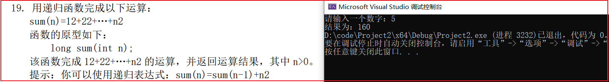

- 收获
  - 写递归问题的关键是，找到递归结束的条件以及本问题如何拆分成规模更少的子问题，其实很多时候凭感觉，这里已知递归表达式，只需找到递归结束的条件即可
  - 递归问题，我认为应该了解其执行过程，更应该从宏观上看待问题，不应该陷入代码的具体细节中

### 第二十题

```c++
#define _CRT_SECURE_NO_WARNINGS//解决在vs2022中scanf不安全的问题
#include <stdio.h>

void itoa(int num, char str[]) {

	bool flag = false;//标记num是否为负数
	if (num < 0) {
		num = -num;
		flag = true;
	}
	//到这里转化为非负数的问题，把数字进行逐位拆分，倒叙放到整型数组中
	int a[20];
	int i = 0;
	while (num != 0) {
		a[i++] = num % 10;
		num /= 10;
	}

	//负数特殊处理后，把a数组中的数据，从后往前拷贝到字符数组中
	int j = 0;
	if (flag) {
		str[j++] = '-';
	}
	for (int k = i - 1; k >= 0; --k){
		str[j++] = '0' + a[k];
	}

	//手动添加字符串结束的标志
	str[j] = '\0';
}

int main() {

	int num;
	printf("请输入一个整数：");
	scanf("%d", &num);

	char str[20];
	itoa(num, str);
	printf("该整数对应的字符串为：%s", str);

	return 0;
}
```

- 运行结果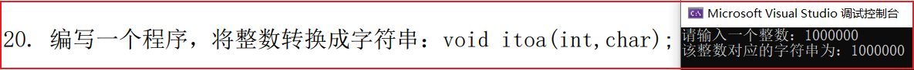

- 收获
  - 要特别注意，循环的边界问题，例如这里的`i, j, k`是多少，心里要清楚
  - 知道数字如何转换为字符串
  - 复习各个数据类型所表示的范围，这里输入的数据太大，爆`int`后会得到错误的结果

### 第二十一题

```c++
#define _CRT_SECURE_NO_WARNINGS//解决在vs2022中scanf不安全的问题
#include <stdio.h>

int main() {

	int year, mouth, day, hour, minute, seconds;
	printf("请输入当前时间：");
	scanf("%d年%d月%d日%d时%d分%d秒", &year, &mouth, &day, &hour, &minute, &seconds);

	//各个月份对应的天数，特别注意2月的天数（闰年还是平年）
	int M[13] = {0, 31, 0, 31, 30, 31, 30, 31, 31, 30, 31, 30, 31};

	//判断2月的天数
	if ((year % 4 == 0 && year % 100 != 0) || year % 400 == 0) {
		M[2] = 29;
	}
	else {
		M[2] = 28;
	}

	//按照相应的进制，模拟进位
	++seconds;
	if (seconds >= 60) {
		++minute;
		seconds = 0;
	}
	if (minute >= 60) {
		++hour;
		minute = 0;
	}
	if (hour >= 24){
		++day;
		hour = 0;
	}
	if (day >= M[mouth]) {
		++mouth;
		day = 1;
	}
	if (mouth >= 12) {
		++year;
		mouth = 1;
	}

	printf("当前时间的下一秒为：%d年%d月%d日%d时%d分%d秒\n", year, mouth, day,
		hour, minute, seconds);
	
	return 0;
}
```

- 运行结果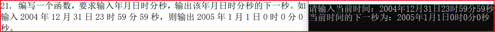

- 收获
  - 注意`scanf`格式的输入，要严格按照书写代码的提示进行输入，否则不能正确赋值
  - 这题要注意2月的天数，然后按照各个数据相应的进位规则，手动模拟即可

### 第二十二题

```c++
#define _CRT_SECURE_NO_WARNINGS//解决在vs2022中scanf不安全的问题
#include <stdio.h>

int main() {

	int a = 1, b = 2;
	printf("交换前：a=%d, b=%d\n", a, b);

	//利用加法思想进行交换
	a = a + b;
	b = a - b;//此时b = a, a = a + b
	a = a - b;//此时b = a, a = a + b - a = b;
	
	printf("交换后：a=%d, b=%d\n", a, b);
	
	return 0;
}
```

- 运行结果

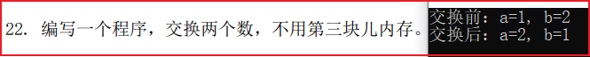

- 收获
  - 这里利用两个变量的加法逻辑，实现不用第三个空间完成交换，但是可读性较差
  - 也可以利用两个数的异或运算的规律进行求解，异或运算的底层原理是计算机是如何存储各种数据的（一般整形数据在计算机中是用**补码**表示的）

### 第二十三题

```c++
#define _CRT_SECURE_NO_WARNINGS//解决在vs2022中scanf不安全的问题
#include <stdio.h>

int main() {

	char str[10000];
	printf("请输入一段文本：");

	//这里虽然把最后的换行符也读入到缓冲区啦，但是对于下面的算法没有影响
	fgets(str, sizeof(str), stdin);

	int sum = 0;

	int i = 0, j = 0;
	while (str[i] != '\0') {
		if ((str[i] >= 'a' && str[i] <= 'z')
			|| (str[i] >= 'A' && str[i] <= 'Z')) {
			
			//遇到单词的第一个字母进行统计
			++sum;

			//把这个单词过滤掉
			while ((str[j] >= 'a' && str[j] <= 'z')
				|| (str[j] >= 'A' && str[j] <= 'Z')) {
				++j;
			}
			i = j;
		}
		++i;
		j = i;//注意这里j也要重新赋值，否则内层的循环会死循环
	}

	printf("这段文本的单词数为：%d\n", sum);

	return 0;
}
```

- 运行结果

  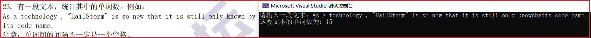

- 收获

  - 核心思想：连续的一段字母构成一个单词，只要遇到连续的一段字母+1即可

    - 具体做法：遇到一个单词的第一个字母进行统计，然后把这个单词过滤掉，继续向后循环，直到文本段结束（这里`fgets`读多读到的一个换行，没有影响）

  - 错误做法：这种做法只使用于输入的文本只有单词和空格得情况，有其他特殊标点就可能出现错误
  
    ```c++
    int sum = 0;
    //特判第一个单词，如果没有这个条件判断，那么第一个单词会被漏掉统计
    if (str[0] != ' ') {
    	sum++;
    }
    for (int i = 0; str[i] != '\0'; i++){
    	//前一个字符是空格，后一个字符不是空格，则单词数+1
    	if (str[i] == ' ' && str[i + 1] != ' ') {
    		sum++;
    	}
    }
    ```
  

### 第二十四题

n-皇后问题不太会

```C++
#include <stdio.h>
#include <stdbool.h>

#define N 8

// 打印棋盘
void printBoard(int board[N][N]) {
    for (int i = 0; i < N; i++) {
        for (int j = 0; j < N; j++) {
            printf("%c ", board[i][j] ? 'Q' : '.');
        }
        printf("\n");
    }
}

// 检查在当前位置放置皇后是否安全
bool isSafe(int board[N][N], int row, int col) {
    // 检查列上是否有皇后
    for (int i = 0; i < row; i++) {
        if (board[i][col]) {
            return false;
        }
    }
    
    // 检查左上方是否有皇后
    for (int i = row, j = col; i >= 0 && j >= 0; i--, j--) {
        if (board[i][j]) {
            return false;
        }
    }
    
    // 检查右上方是否有皇后
    for (int i = row, j = col; i >= 0 && j < N; i--, j++) {
        if (board[i][j]) {
            return false;
        }
    }
    
    return true;
}

// 解决八皇后问题的辅助函数
bool solveNQueensUtil(int board[N][N], int row) {
    // 如果所有皇后都被放置，则返回true
    if (row == N) {
        return true;
    }
    
    for (int col = 0; col < N; col++) {
        // 检查在当前位置放置皇后是否安全
        if (isSafe(board, row, col)) {
            // 放置皇后
            board[row][col] = 1;
            
            // 递归放置下一个皇后
            if (solveNQueensUtil(board, row + 1)) {
                return true;
            }
            
            // 如果无法放置下一个皇后，则回溯当前位置
            board[row][col] = 0;
        }
    }
    
    // 如果无法放置当前皇后，则返回false
    return false;
}

// 解决八皇后问题
void solveNQueens() {
    int board[N][N] = {0};

    if (solveNQueensUtil(board, 0)) {
        printf("找到一个解决方案：\n");
        printBoard(board);
    } else {
        printf("无法找到解决方案。\n");
    }
}

int main() {
    solveNQueens();
    return 0;
}
```

### 第二十五题

```c++
#define _CRT_SECURE_NO_WARNINGS//解决在vs2022中scanf不安全的问题
#include <stdio.h>

int main() {

	char a[100] = "My name is Li jilin.";
	char b[] = "Mr. Zhang Haoling is very happy.";
	
	int i = 4;
	for (i; i <= 16; ++i) {
		a[i + 7] = b[i];
	}

	//保险起见，手动置字符串结束标志，其实这里不手动
	//置0也可以，因为a数组足够长，后面自动补零，
	// 为了保险，建议还是手动置0
	a[i + 7] = '\0';

	printf("新的字符串为：%s", a);

	return 0;
}
```

- 运行结果

  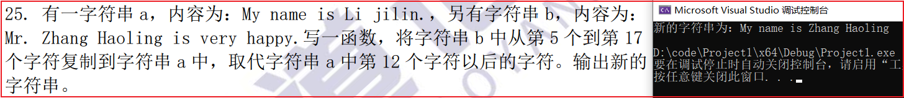

- 收获
  - 这里a数组比较短，如果要是覆盖赋值，需要把a数组开长一点，要始终牢记字符串结束的标志是什么，建议手动置0作为字符串结束的标志

### 第二十六题

```c++
#define _CRT_SECURE_NO_WARNINGS//解决在vs2022中scanf不安全的问题
#include <stdio.h>

double func(int n) {

	double sum = 0;
	for (int i = 1; i <= 20; i++) {
		sum += 1 / (i * 2.0);
	}

	return sum;
}

int main() {

	int n;
	printf("请输入项数：");
	scanf("%d", &n);
	printf("前20项的和为：%.8lf\n", func(n));

	return 0;
}
```

- 运行结果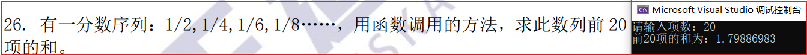

- 收获
  - 注意选择合适的数据类型，循环累加统计即可，注意`int`如何转浮点类型即可

### 第二十七题

```c++
#define _CRT_SECURE_NO_WARNINGS//解决在vs2022中scanf不安全的问题
#include <stdio.h>
#include <stdlib.h>

//定义单链表结构体
typedef int ElemType;
typedef struct LinkNode {
	ElemType data;
	struct LinkNode* next;
}LinkNode, * LinkList;


void insertNode(LinkList L) {
	//尾插赋值
	LinkNode* p = L;
	for (int i = 1; i <= 10; i++){
		LinkNode* q = (LinkNode*)malloc(sizeof(LinkNode));
		q->data = i;
		p->next = q;
		p = q;
	}
	p->next = NULL;
}

//查找到要删除元素的前一个位置
LinkNode* find(LinkList L, int num) {
	LinkNode* p = L;
	while (p->next != NULL){
		if (p->next->data == num) {
			return p;
		}
		p = p->next;
	}
	return NULL;
}

//按值删除
bool deleteNode (LinkList L, int* temp) {

	int num;
	printf("请输入要删除的数据：");
	scanf("%d", &num);
	
	if (L->next == NULL) return false;//链表为空，删除失败

	LinkNode* p = find(L, num);

	if (p == NULL) return false;	 //链表中，不存在值为num的节点

	//删除值为num的节点
	LinkNode* q = p->next;
	*temp = q->data;//删除的值带回
	p->next = q->next;
	free(q);//值为num节点的内存，释放掉

	return true;
}

//打印
void printList(LinkList L) {
	LinkNode* p = L->next;
	while (p != NULL){
		printf("%d ", p->data);
		p = p->next;
	}
	printf("\n");
}

//初始化单链表
//这里先不用引用，先用二级指针来解决
bool init(LinkList *L) {
	*L = (LinkNode*)malloc(sizeof(LinkNode));//分配头节点
	if (*L == NULL) return false;
	(*L)->next = NULL;
	return true;
}

int main() {

	LinkList L;//定义一个链表
	init(&L);
	insertNode(L);
	
	printf("删除前的链表为：");
	printList(L);

	int num;
	deleteNode(L, &num);
	
	printf("删除后的链表为：");
	printList(L);

	return 0;
}
```

- 运行结果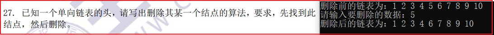

- 收获
  - 其实这里就是基本的代码，细节还是挺多的，如果之前不是写过，完整写下来还是费点功夫的
  - 带头结点的单链表更容易操作，因为对这个单链表的操作可以得到统一，不需要特殊判断

### 第二十八题

```c++
#define _CRT_SECURE_NO_WARNINGS//解决在vs2022中scanf不安全的问题
#include <stdio.h>

void bubbleSort(int a[], int length) {

	//外层循环是轮数，对n个数进行冒泡排序，只需要n-1轮
	for (int i = 0; i < length - 1; ++i) {

		//每次都把最大的数沉底，没一大轮沉底一个
		for (int j = 0; j < length - i - 1; ++j) {
			if (a[j] > a[j + 1]) {
				int t = a[j];
				a[j] = a[j + 1];
				a[j + 1] = t;
			}
		}
	}
}

int main() {

	int a[10];
	printf("请输入10个整数：");
	for (int i = 0; i < 10; ++i) {
		scanf("%d", &a[i]);
	}

	bubbleSort(a, 10);

	printf("排序后的结果为：");

	for (int i = 0; i < 10; ++i) {
		printf("%d ", a[i]);
	}

	return 0;
}
```

- 运行结果
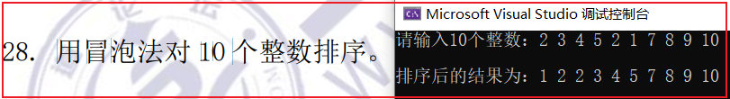

- 收获
  - 经典的交换排序算法之一，核心思想就是，外层循环确定排序的轮数，内层循环使最大的数字沉底

### 第二十九题

```c++
#define _CRT_SECURE_NO_WARNINGS//解决在vs2022中scanf不安全的问题
#include <stdio.h>
#include <math.h>

int func(long long num) {
	
	int ans = 0;
	int i = 0;

	//把整数数字进行拆分
	while (num != 0) {
		ans += (int)(num % 10) * pow(2, i);
		num /= 10;
		++i;

		//4位一组进行处理
		if (i == 4) {
			i = 0;
		}
		
	}
	return ans;
}

int main() {

	long long n;
	printf("请输入一个16位的整数：");
	scanf("%lld", &n);
	printf("\n结果为：%d\n", func(n));

	return 0;
}
```

- 运行结果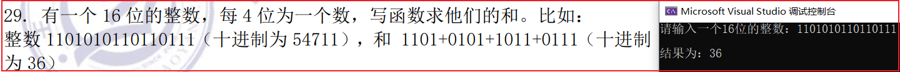

- 收获
  - 其实就是4位一组模拟2进制加法
  - 注意数据类型的选取，这里要用long long类型来接受数据，再长一点就可以用字符数组进行处理

### 第三十题

```c++
#include <stdio.h>

void josephus(int n, int m, int k) {
    int people[n];
    int sequence[n];

    // 初始化人员编号
    for (int i = 0; i < n; ++i) {
        people[i] = i + 1;
    }

    int idx = k - 1; // 报数起始位置
    int count = n;

    // 开始报数并出列
    for (int i = 0; i < n; ++i) {
        int step = m % count;
        idx = (idx + step) % count;

        sequence[i] = people[idx];

        // 将出列的人从数组中移除
        for (int j = idx; j < count - 1; ++j) {
            people[j] = people[j + 1];
        }

        idx = (idx == count - 1) ? 0 : idx; // 考虑数组越界情况
        count--;
    }

    // 输出出队编号序列
    printf("出队编号序列: ");
    for (int i = 0; i < n; ++i) {
        printf("%d ", sequence[i]);
    }
    printf("\n");
}

int main() {
    int n = 10; // 人数
    int m = 3;  // 报数到m的人出列
    int k = 1;  // 开始报数的人的编号
    josephus(n, m, k);

    return 0;
}

```

## C++

### 第三十一题

```c++
#include <iostream>

using namespace std;

class String{

public:
	//通过构造函数，来初始化数据成员
	String(char* head);

	//打印输出
	void print();

	//反转字符串
	void reverse();

	//析构函数，当对象销毁时，进行调用
	~String();

private:
	char head[100];
};

String::String(char* Head){
	
	int i = 0;
	while ((*Head) != '\0') {
		this->head[i++] = (*Head);
		Head++;
	}
	this->head[i] = '\0';
}

String::~String()
{
}

void String::reverse(){
	int length = 0;

	//统计字符串长度,其实统计长度多了1
	while (this->head[length++] != '\0') {}

	//逆置
	for (int i = 0; i < (length - 1) / 2; ++i) {
		//交换
		char temp = this->head[i];
		this->head[i] = this->head[length - i - 2];
		this->head[length - i - 2] = temp;
	}
	//其实原来，这个元素的值就是'\0'，保险期间，最好还是手动赋值
	this->head[length - 1] = '\0';

}

void String::print(){
	cout << this->head << endl << endl;
}

int main() {

	char str[] = "I love C++";
	
	String s(str);
	cout << "原字符串：";
	s.print();

	s.reverse();
	cout << "反转后字符串为：";
	s.print();

	return 0;
}
```

- 运行结果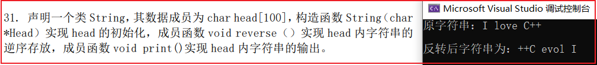

- 收获
  - `C++`很久没写啦，确实有点忘记啦
  - `this`的含义是当前对象，一般用`this->`而不是`this.`数据成员或者成员函数
  - 定义类时，类的内部最好只写成员函数的声明，具体实现在外面实现，之后可能一个类对应一个`.cpp`文件和一个`.h`文件
  - 在定义类的时候，其中的数据成员最好私有化，而通过公共的成员函数对其私有数据成员进行访问，体现封装性
  - 我认为封装性的含义
    - 一种理解，把具有相同属性的对象封装成一个类
    - 另外一种理解，类的数据成员私有化，然后通过公共的成员函数对私有的数据成员进行访问

### 第三十二题

```c++
#include <iostream>

using namespace std;

class Box {
public:
	//设置形状
	void SetShape(double length, double width, double height);
	//计算盒子体积
	void CalculateV();
	//计算表面积
	void CalculateS();
	//得到盒子的表面积
	double GetV();
	//得到盒子的表面积
	double GetS();
	Box(double length, double width, double height);
	~Box();

private:
	double length;
	double width;
	double height;
	double V;
	double S;
};

void Box::SetShape(double length, double width, double height) {
	this->length = length;
	this->width = width;
	this->height = height;
}

void Box::CalculateV() {
	this->V = this->length * this->width * this->height;
}

void Box::CalculateS() {
	this->S = 2 * (this->length * this->width + this->length * this->height +
		this->width * this->height);
}

double Box::GetV()
{
	return this->V;
}

double Box::GetS()
{
	return this->S;
}

Box::Box(double length, double width, double height) {
	this->length = length;
	this->width = width;
	this->height = height;
	this->S = 0;
	this->V = 0;
}

Box::~Box() {
}

int main() {

	Box b(1, 2, 3);//通过构造函数创建对象，并给其数据成员赋值
	
	b.CalculateS();
	b.CalculateV();
	cout << "该盒子的表面积为：" << b.GetS() << " "
		<< "该盒子的体积为：" << b.GetV() << endl << endl;;

	b.SetShape(2, 3, 4);
	b.CalculateS();
	b.CalculateV();
	cout << "重新设置的盒子的表面积为：" << b.GetS() << " "
		<< "重新设置的盒子的体积为：" << b.GetV() << endl << endl;

	return 0;
}
```

- 运行结果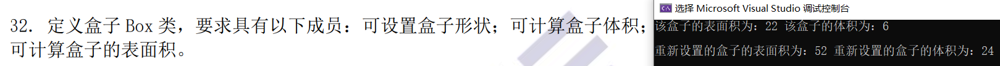

- 收获
  - 构造函数的作用就是创建一个对象，并对该对象的数据成员进行初始化
  - 这个的构造函数，和`SetShape()`函数看起来作用类似，但其实不同，构造函数每个对象只能调用一次，而这里的`SetShape()`函数每个对象可以调用无数次

### 第三十三题

```c++
#include <iostream>

using namespace std;

class Tree{
public:
	//默认构造函数
	Tree();
	//默认析构函数
	~Tree();
	//树的生长函数
	void grow(int years);
	//展示树的年龄
	void showAge();

private:
	int ages;
};

Tree::Tree(){
	this->ages = 0;
}

Tree::~Tree(){
}

void Tree::grow(int years) {
	this->ages += years;
}

void Tree::showAge() {
	cout << "树的年龄为：" << this->ages << endl;
}

int main() {
	
	//这里对应Tree的默认构造函数
	Tree t;
	t.grow(12);
	t.showAge();

	return 0;
}
```

- 运行结果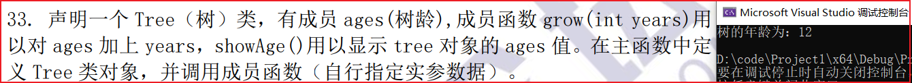

- 收获
  - 就是利用构造函数初始话数据成员，然后通过公共的成员函数对私有的数据成员进行访问

### 第三十四题

```c++
#include <iostream>
#include <string>

using namespace std;

class Student {
public:
	Student (string name, int score);
	~Student ();

	//通过友元函数，访问对象的私有数据，而限制其对该对象私有数据的修改
	friend void PrintLevel(const Student& s);

private:
	string name;
	int score;
};

Student ::Student (string name, int score) {
	this->name = name;
	this->score = score;
}

Student ::~Student () {
}
void PrintLevel(const Student& s) {
	if (s.score >= 90) {
		cout << s.name << "的成绩为：" << s.score << " 对应的等级为：" <<" 优" << endl << endl;
	}
	else if (s.score >= 80 && s.score < 90) {
		cout << s.name << "的成绩为：" << s.score << " 对应的等级为：" << "良" << endl << endl;
	}
	else if (s.score >= 70 && s.score < 80) {
		cout << s.name << "的成绩为：" << s.score << " 对应的等级为：" << "中" << endl << endl;
	}
	else if (s.score >= 60 && s.score < 70) {
		cout << s.name << "的成绩为：" << s.score << " 对应的等级为：" << "及格" << endl << endl;
	}
	else if (s.score < 60){
		cout << s.name << "的成绩为：" << s.score << " 对应的等级为：" << "不及格" << endl << endl;
	}
}

int main() {

	Student s1("张三", 99);
	PrintLevel(s1);

	Student s2("李四", 89);
	PrintLevel(s2);

	Student s3("王五", 70);
	PrintLevel(s3);

	Student s4("赵六", 65);
	PrintLevel(s4);

	Student s5("秦七", 59);
	PrintLevel(s5);

	return 0;
}
```

- 运行结果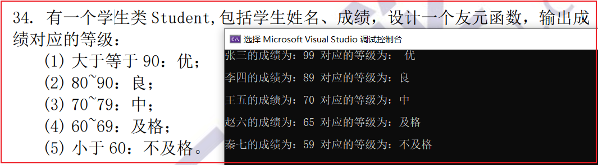

- 收获
  - 有关友元
    - 目的：就是访问一个对象的私有的数据成员，这样其实不安全，打破了数据的封装性，但是可以通过形参列表进行限制，如`const Student& s`，这样访问这个对象的私有数据成员而无法修改
    - 三种形式：形参都是一个类的对象，没有this指针
      - 友元函数：相当于普通函数作为一个类的友元，这个函数不是成员函数
      - 友元成员函数：一个类的成员函数作为一个类的友元
      - 友元类：一个类作为另一个类的友元，那么这个类的所有成员函数，都可以访问另一个类的所有私有数据成员

### 第三十五题

```c++
#include <iostream>

using namespace std;

class Plural
{
public:
	Plural(int Real, int Virtual);
	~Plural();
	friend Plural operator+(const Plural& a, const Plural& b);
	void PrintPlural();

private:
	int Real;
	int Virtual;
};

Plural::Plural(int Real, int Virtual) {
	this->Real = Real;
	this->Virtual = Virtual;
}

Plural::~Plural() {
}

void Plural::PrintPlural() {
	if (this->Virtual > 0) {
		cout << this->Real << " + " << this->Virtual << "i" << endl << endl;
	}
	else if (this->Virtual == 0) {
		cout << this->Real << endl << endl;
	}
	else {
		cout << this->Real << " - " << this->Virtual << "i" << endl << endl;
	}
}

Plural operator+(const Plural& a, const Plural& b) {

	//复数的加法计算
	int NewReal = a.Real + b.Real;
	int NewVirtual = a.Virtual + b.Virtual;

	return Plural(NewReal, NewVirtual);
}

int main() {

	Plural p1(1, 2);
	cout << "p1：";
	p1.PrintPlural();

	Plural p2(3, 4);
	cout << "p2：";
	p2.PrintPlural();

	Plural p3 = p1 + p2;
	cout << "p1 + p2 = ";
	p3.PrintPlural();

	return 0;
}
```

- 运行结果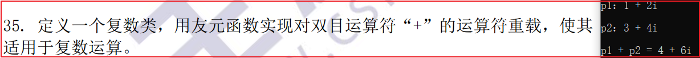
- 收获
  - 函数重载：同一个函数名，形参列表不同，那么编译器可以通过参数列表的不同来确定调用哪个函数（静态多态和后面的动态多态（函数重写对应））
  - 函数重载一般包括：普通函数的重载，成员函数的重载，运算符的重载
  - 运算符重载（一般两种形式：**友元函数**运算符重载和**类成员函数**运算符重载）
    - 单目运算符和复合运算符最好被重载为成员函数
      - 用成员函数重载时，隐含一个当前对象（其实本质还是通过对象.成员函数的形式），参数-1，详细见`cpp`课件，第四章`p19`
    - 对双目运算符最好被重载友元函数

### 第三十六题

#### 重载前自增

```c++
this->#include <iostream>
#include <cstdio>

using namespace std;

class Time
{
public:
	Time();
	~Time();
	Time operator++();
	void ShowTime();

private:
	int minute;
	int sec;
};

Time::Time() {
	this->minute = 0;
	this->sec = 0;
}

Time::~Time() {
}

Time Time::operator++()
{
	if (++(this->sec) >= 60) {
		this->sec = 0;
		++(this->minute);
	}

	//返回当前对象，不需要副本
	return *this;
}

void Time::ShowTime() {
	printf("时间：%02d：%02d  ", this->minute, this->sec);
}

int main() {

	Time t;
	for (int i = 1; i < 65; ++i) {
		++t;
		t.ShowTime();
		if (i % 8 == 0) {
			cout << endl;
		}
	}

	return 0;
}
```

- 运行结果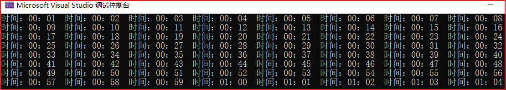

#### 重载后自增

```c++
#include <iostream>
#include <cstdio>

using namespace std;

class Time
{
public:
	Time();
	~Time();
	Time operator++();
	Time operator++(int);
	void ShowTime();

private:
	int minute;
	int sec;
};

Time::Time() {
	this->minute = 0;
	this->sec = 0;
}

Time::~Time() {
}

Time Time::operator++()
{
	if (++(this->sec) >= 60) {
		this->sec = 0;
		++(this->minute);
	}

	//返回当前对象，不需要副本
	return *this;
}

Time Time::operator++(int) {
	//保存当前对象的副本
	Time temp = (*this);

	//当前对象进行自增
	if (++(this->sec) >= 60) {
		this->sec = 0;
		++(this->minute);
	}

	//返回之前对象的副本
	return temp;
}

void Time::ShowTime() {
	printf("时间：%02d：%02d  ", this->minute, this->sec);
}

int main() {

	Time t;
	for (int i = 1; i < 65; ++i) {
		(t++).ShowTime();
		if (i % 8 == 0) {
			cout << endl;
		}
	}

	return 0;
}
```

- 运行结果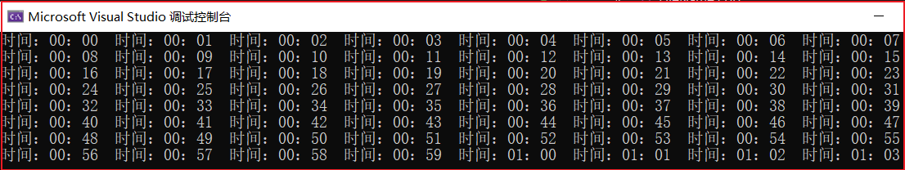
- 收获
  - 首先，重载单目运算符一般用成员函数进行重载，用成员函数进行重载时，隐藏一个当前对象
  - 因为前自增和后自增的含义是不同的，**所以重载时也有区别**
    - 重载前自增时，不用保存自增前的副本，直接对当前对象进行操作，返回时也是返回当前对象
    - 重载后自增时，需要保存自增前的副本，也是对当前对象进行操作，但是返回时返回的是自增前的对象副本

### 第三十七题

```c++
#include <iostream>
#include <cstdio>

using namespace std;

class Triangle
{
public:
	Triangle(double L1, double L2, double L3);
	~Triangle();
	friend double operator+ (Triangle& a, Triangle& b);
	double CalculateS();

private:
	double L1;
	double L2;
	double L3;
};

Triangle::Triangle(double L1, double L2, double L3) {
	this->L1 = L1;
	this->L2 = L2;
	this->L3 = L3;
}

Triangle::~Triangle() {
}

double Triangle::CalculateS() {

	//半周长
	double s = (this->L1 + this->L2 + this->L3) / 2;

	//利用海伦公式计算面积
	double S = sqrt(s * (s - this->L1) * (s - this->L2) * (s - this->L3));

	return S;
}

int main() {

	Triangle t1(3, 4, 5);
	Triangle t2(5, 12, 13);
	cout << "三角形t1的面积为：" << t1.CalculateS() << endl;
	cout << "三角形t2的面积为：" << t2.CalculateS() << endl;

	double sum = t1 + t2;
	cout << "三角形t1+t2的面积为：" << sum << endl;

	return 0;
}

double operator+(Triangle& a, Triangle& b) {
	double sum = a.CalculateS() + b.CalculateS();
	return sum;
}
```

- 运行结果

- 收获
  - 这里通过友元函数，实现两个对象相加，并返回非对象类型
  - 只是实现相应的效果，比较容易，但是做到既能保证数据的安全性，又能省内存空间，还需要走很长的路

### 第三十八题

```c++
#include <iostream>
#include <cstdio>

using namespace std;

int add(int a, int b) {
	return a + b;
}

double add(double a, double b) {
	return a + b;
}

int main() {

	int a = 1, b = 2;
	double c = 1.0, d = 2.0;
	cout << "a + b = " << add(a, b) << endl;
	printf("c + d = %.2lf\n", add(c, d));

	return 0;
}
```

- 运行结果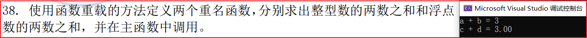

- 收获
  - 就是同名函数，编译器通过不同的参数列表来区分不同的函数

### 第三十九题

```c++
#include <iostream>
#include <string>

using namespace std;

//形状基类
class Shape {
public:
	Shape ();
	Shape(string name);
	~Shape ();

	//纯虚函数，const关键字用于指定成员函数CalculateArea()是一个常量成员函数。
	// 常量成员函数表示该函数不会修改类的成员变量，当传对象的引用时可以保护数据的安全性，这里可以忽略
	virtual double CalculateArea() const= 0;

protected:
	string name;
};

Shape::Shape() {
}

Shape::Shape(string name) {
	this->name = name;
}

Shape ::~Shape() {
}

//长方形类继承形状类
class Rectangle : public Shape {

public:
	Rectangle();
	Rectangle(string name, double L, double W);
	~Rectangle();
	virtual double CalculateArea() const;

private:
	double L;
	double W;
};

Rectangle::Rectangle() {
	this->L = 0;
	this->W = 0;
}

Rectangle::Rectangle(string name, double L, double W) : Shape(name) {
	this->L = L;
	this->W = W;
}

Rectangle::~Rectangle() {

}

double Rectangle::CalculateArea() const{
	return this->L * this->W;
}

//梯形类继承形状基类
class Trapezoid : public Shape {
public:
	Trapezoid();
	Trapezoid(string name, double UpperBottom, double Bottom, double H);
	~Trapezoid();
	virtual double CalculateArea() const;

private:
	double UpperBottom;
	double Bottom;
	double H;
};

Trapezoid::Trapezoid() {
	this->Bottom = 0;
	this->H = 0;
	this->UpperBottom = 0;
}

Trapezoid::Trapezoid(string name, double UpperBottom, double Bottom, double H) : Shape(name){
	this->UpperBottom = UpperBottom;
	this->Bottom = Bottom;
	this->H = H;
}

Trapezoid::~Trapezoid()
{
}

double Trapezoid::CalculateArea() const {
	return (this->UpperBottom + this->Bottom) * this->H / 2.0;
}

//圆类继承于形状类
class Round : public Shape
{
public:
	Round();
	Round(string name, double R);
	virtual double CalculateArea() const;
	~Round();

private:
	double R;
};

Round::Round(){
	this->R = 0;
}

Round::Round(string name, double R) : Shape(name){
	this->R = R;
}

double Round::CalculateArea() const {
	return 3.14 * this->R * this->R;
}

Round::~Round() {
}


int main() {

	Rectangle r("长方形", 3, 4);
	Trapezoid t("梯形", 3, 4, 5);
	Round R("圆形", 4);
	Shape* s = &r;
	cout << "该长方形的面积为：" << s->CalculateArea() << endl;

	s = &t;
	cout << "该梯形的面积为：" << s->CalculateArea() << endl;

	s = &R;
	cout << "该圆形的面积为：" << s->CalculateArea() << endl;

	return 0;
}
```

- 运行结果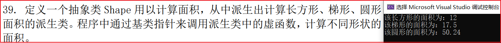

- 收获
  - 带有纯虚函数的类叫做抽象类，抽象类就是为了被子类继承的，并给子类以限制，子类如果想实例对象，那么必须实现从父类继承而来的纯虚函数
  - 如果继承抽象类，一般都是公共继承（有关类的成员的权限和继承时权限的选择还需要强化）
  - 基类中的纯虚函数一般也是public的
  - 参考`cpp`课件第六章`p27`
  - `double Trapezoid::CalculateArea(类名 &a) const`这种写法就是为了限制对传过来的对象进行修改

### 第四十题

```c++
#include <iostream>

using namespace std;

class Counter
{
public:
	Counter();
	~Counter();
	Counter(int value);
	void Add(int a);
	void Sub(int a);
	int GetValue();

private:
	int value;
};

Counter::Counter() {
	this->value = 0;
}

Counter::~Counter()
{
}

Counter::Counter(int value) {
	this->value = value;
}

int Counter::GetValue() {
	return this->value;
}

void Counter::Add(int a) {
	this->value += a; 
}

void Counter::Sub(int a) {
	this->value -= a;
}

int main() {

	Counter c(1);
	cout << "当前的数值为：" << c.GetValue() << endl << endl;

	c.Add(5);
	cout << "增值5之后的数值为：" << c.GetValue() << endl << endl;

	c.Sub(6);
	cout << "减值6之后的数值为：" << c.GetValue() << endl << endl;

	return 0;
}
```

- 运行结果

- 收获
  - 基本代码，就似乎通过公共的成员函数去访问类中私有的数据成员

### 第四十一题

```c++
#include <iostream>

using namespace std;

class Counter
{
public:
	Counter();
	~Counter();
	Counter(int value);
	void Add(int a);
	void Sub(int a);
	int GetValue();

private:
	int value;
};

Counter::Counter() {
	this->value = 0;
}

Counter::~Counter()
{
}

Counter::Counter(int value) {
	this->value = value;
}

int Counter::GetValue() {
	return this->value;
}

void Counter::Add(int a) {
	this->value += a; 
}

void Counter::Sub(int a) {
	this->value -= a;
}

int main() {

	Counter c(1);
	cout << "当前的数值为：" << c.GetValue() << endl << endl;

	c.Add(5);
	cout << "增值5之后的数值为：" << c.GetValue() << endl << endl;

	c.Sub(6);
	cout << "减值6之后的数值为：" << c.GetValue() << endl << endl;

	return 0;
}
```

- 运行结果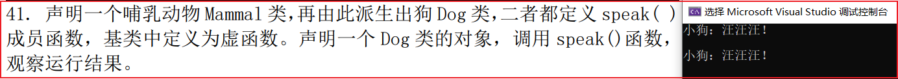

- 收获
  - 赋值兼容原则为运行时多态提供了基础，子类重写和父类同名的虚函数实现了运行时多态
  - 如果子类和父类都有同名的函数，那么通过基类指针只能调用父类的那个函数

### 第四十二题

```c++
#include <iostream>
#include <cmath>
#include <vector>

using namespace std;

//基类
class Base {
public:
	Base();
	~Base();
	virtual double CalculateArea();

private:

};

Base::Base()
{
}

Base::~Base()
{
}

double Base::CalculateArea() {
	return 0.0;
}

//三角形类继承于Base类
class Triangle : public Base
{
public:
	Triangle();
	~Triangle();
	Triangle(int a, int b, int c);
	virtual double CalculateArea();
	vector<int> GetABC();

private:
	double a;
	double b;
	double c;
};

Triangle::Triangle() {
	this->a = 0;
	this->b = 0;
	this->c = 0;
}

Triangle::~Triangle()
{
}

Triangle::Triangle(int a, int b, int c) {
	this->a = a;
	this->b = b;
	this->c = c;
}

//重写父类虚函数计算面积
double Triangle::CalculateArea() {
	double s = (this->a + this->b + this->c) / 2.0;
	double S = sqrt(s * (s - this->a) * (s - this->b) * (s - this->c));
	return S;
}

vector<int> Triangle::GetABC() {
	vector<int> t;
	t.push_back(this->a);
	t.push_back(this->b);
	t.push_back(this->c);
	return t;
}

//正方形类继承于Base类
class Square : public Base
{
public:
	Square();
	~Square();
	Square(double l);
	virtual double CalculateArea();
	double GetL();

private:
	double l;
};

Square::Square() {
	this->l = 0;
}

Square::~Square()
{
}

Square::Square(double l) {
	this->l = l;
}

double Square::CalculateArea() {
	return this->l * this->l;
}

double Square::GetL() {
	return this->l;
}

class Round
{
public:
	Round();
	Round(double r);
	~Round();
	virtual double CalculateArea();
	double GetR();
private:
	double r;
};

Round::Round() {
	this->r = 0;
}

Round::Round(double r) {
	this->r = r;
}

Round::~Round()
{
}

double Round::CalculateArea() {
	return 3.14 * this->r * this->r;
}

double Round::GetR() {
	return this->r;
}

int main() {

	Triangle t(3, 4, 5);
	vector<int> v = t.GetABC();
	cout << "三角形的三边是" << v[0] << ' ' << v[1] << ' ' << v[2] 
		<< "的面积为："
		<< t.CalculateArea() << endl << endl;

	Square s(4);
	cout << "边长为" << s.GetL() << "正方形的面积为：" 
		<< s.CalculateArea() << endl << endl;

	Round r(4);
	cout << "半径为" << r.GetR() << "的圆形的面积为："
		<< r.CalculateArea() << endl << endl;

	return 0;
}
```

- 运行结果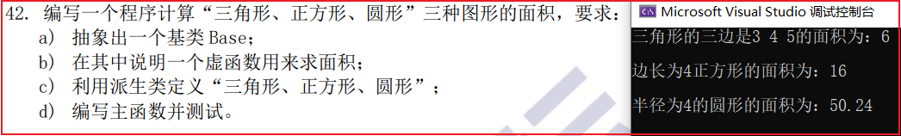

- 收获
  - 这题的是实现和`t39`有点区别，这里相当于子类重写了父类的虚函数，通过子类的对象调用函数，肯定是访问子类对应的成员函数，当然这里也可以利用基类指针指向子类对象的方式进行访问

### C++总体总结

- 定义一个类的时候要思考这个类有什么属性，有什么行为，一般属性决定行为
- 构造函数很关键，构造函数的作用就是创建一个对象并为该对象的数据成员赋初值，默认缺省的构造函数最好保留，其他需要什么构造函数再写什么构造函数
- 类的数据成员私有化，然后通过类公共的成员函数加以限制的访问私有的数据成员体现了封装性
- 继承性主要就是为了代码的复用
- 多态有一般有两种体现，函数的重载（静态多态）和函数的重写（动态多态）
- 抽象类中的纯虚函数可以理解为对子类制定规则，子类想要实例对象，必须重写从父类继承的纯虚函数

## `STL`

### 第四十三题

#### 程序1

```c++
#include <iostream>
#include <string>

using namespace std;

int main() {

	string s;
	cout << "请输入一行内容，可以包括空格等任意字符：";
	while (getline(cin, s)) {
		cout << s << endl << endl;
		cout << "请输入一行内容，可以包括空格等任意字符：";
	}

	return 0;
}
```

- 运行结果

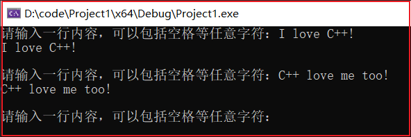

- 收获
  - 利用`getline`函数可以把标准输入的一整行数据输入到`string`对象中，可以包括空格，这里遇到回车结束

#### 程序2

```c++
#include <iostream>
#include <string>

using namespace std;

int main() {

	string s;
	cout << "请输入任意一个单词，不包括空格：";
	
	while (cin >> s) {
		cout << s << endl << endl;
		cout << "请输入任意一个单词，不包括空格：";
	}

	return 0;
}
```

- 运行结果

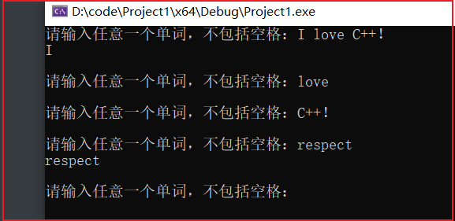

- 收获
  - 从运行结果可以发现，这种方式只能读取一个没有空格的单词，遇到空格会结束读取
  - 当我们输入一行含有空格的字符串时，他会按照空格和最后的回车依次进行拆分读取到`string`对象中去

### 第四十四题

- `>>`运算符输入数据到string对象中，遇到空格，回车，换行就会停止
- `getline`函数会把一行数据读入到string对象中，一般遇到换行符结束，并且最后的换行符既不会被读入`string`对象中，也不会存放到缓冲区中

### 第四十五题

#### 程序1

```c++
#include <iostream>
#include <string>

using namespace std;

int main() {

	string str, ans = "";
	char flag = '0';
	cout << "请输入一个字符串：";

	while (cin >> str) {
		ans += str;
		cout << "如果想停止输入请输入字符1，否则输入其他任意字符：";
		cin >> flag;
		if (flag == '1') {
			break;
		}
		cout << "请输入一个字符串：";
	}

	cout << "最终拼接后的大字符串为：" << ans << endl;

	return 0;
}
```

- 运行结果

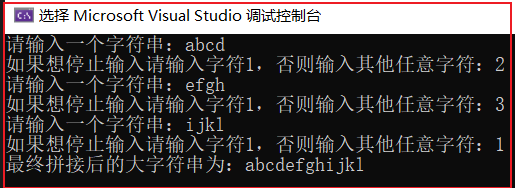

- 收获
  - 关键是理解题意，并利用一个标志位控制输入输出，`string`对象直接可以通过+号进行拼接

#### 程序2

```c++
#include <iostream>
#include <string>

using namespace std;

int main() {

	string str, ans = "";
	char flag = '0';
	bool flag1 = true;//增加标志位，进行空格拼接
	cout << "请输入一个字符串：";

	while (cin >> str) {

		if (flag1 == false) {
			ans += " " + str;
		}

		if (flag1) {
			ans += str;
			flag1 = false;
		}
		
		cout << "如果想停止输入请输入字符1，否则输入其他任意字符：";
		cin >> flag;
		if (flag == '1') {
			break;
		}
		cout << "请输入一个字符串：";
	}

	cout << "最终拼接后的含有空格的字符串为：" << ans << endl;

	return 0;
}
```

- 运行结果

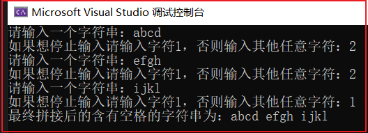

- 收获
  - 和程序1不同的就是，再增加一个标志位控制空格的拼接，第一次直接拼接，此后的若干次都是用`" "+str`的方式进行拼接

### 第四十六题

```c++
#include <iostream>
#include <string>
#include <cctype>

using namespace std;

int main() {

	string str;
	cout << "请输入一个含有标点的字符串：";
	cin >> str;
	str.erase(str.end() - 1);

	for (int i = 0; i < str.size(); ++i) {
		
		//最后一个字符是标点进行特判
		if (ispunct(str[str.size() - 1])) {
			str.erase(str.end() - 1);
		}

		//非最后一个字符的处理
		if (ispunct(str[i]) && i != str.size() - 1) {

			//循环向前覆盖
			for (int j = i; j < str.size(); ++j) {
				str[j] = str[j + 1];
			}
			//把原来的最后一个字符删除，字符串长度会自动-1
			str.erase(str.end() - 1);
			//注意这里删除后，当前字符可能由于后移，任然是标点
			i -= 1;
		}
	}
	cout << "删除标点后的字符串为：" << str << endl;

	return 0;
}
```

- 运行结果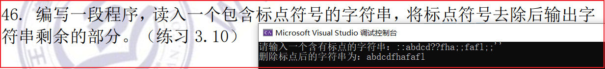

- 收获
  - 这里可以把`string`对象看成一个数组，然后就是循环左移删除字符，注意最后一个字符的特判以及，在删除后当前字符可能又是一个标点，所以下一次需要从当前位置进行删除

### 第四十七题

```c++
#include <iostream>
#include <vector>

using namespace std;

void MyPrint(vector<int>& v) {
	for (vector<int>::iterator it = v.begin(); it != v.end(); ++it) {
		cout << *it << " ";
	}
	cout << endl << endl;
}

void Mul2(vector<int>& v) {
	for (vector<int>::iterator it = v.begin(); it != v.end(); ++it) {
		*it *= 2;
	}
}

int main() {

	vector<int> v(10);

	for (int i = 0; i < 10; ++i) {
		v[i] = i + 1;
	}
	cout << "vector中原来的内容为：";
	MyPrint(v);

	Mul2(v);
	cout << "vector中所有元素乘以2后的内容为：";
	MyPrint(v);

	return 0;
}
```

- 运行结果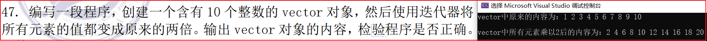

- 收获
  - 迭代器，暂时可以理解为一个指针，指向类型为<>中的类型

### 第四十八题

#### 程序1

```c++
#include <iostream>
#include <string>

using namespace std;

int main() {

	string a, b;
	cout << "请输入字符串a, b：";
	while (cin >> a >> b) {
		if (a > b) {
			cout << "a > b" << endl;
		}
		else if (a < b) {
			cout << "a < b" << endl;
		}
		else {
			cout << "a == b" << endl;
		}
		cout << "请输入字符串a, b：";

	}
	
	return 0;
}
```

- 运行结果

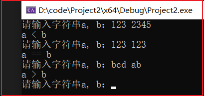

- 收获
  - 比较两个string类型的对象，是按照字典顺序一位一位向后比较的，和字符串的长度是没有关系的

#### 程序2

```c++
#include <iostream>
#include <string>
#include <cstdio>

using namespace std;

int main() {

	char a[100];
	char b[100];
	cout << "请输入字符串a, b：";
	while (cin >> a >> b) {
		if (strcmp(a, b) > 0) {
			cout << "a > b" << endl;
		}
		else if (strcmp(a, b) < 0) {
			cout << "a < b" << endl;
		}
		else {
			cout << "a == b" << endl;
		}
		cout << "请输入字符串a, b：";

	}
	
	return 0;
}
```

- 运行结果

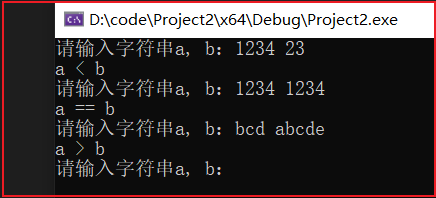

- 收获
  - c风格的字符串一般用字符数组来存放（可以读取，用字符指针存放的只能读不能写），可以借助`strcmp`函数进行比较，比较规则和程序1的string对象一样

### 第四十九题

- 1）用list比较方便，，因为该操作可能涉及到插入排序，可能会移动大量的元素，`list`底层是双向循环链表，插入比较方便，而`vector`和`deque`底层都是数组，插入和移动都不方便
- 2）用`deque`比较方便，`deque`是双端数组，头部和尾部的操作都比较方便，而且支持随机访问
- 3）用`vector`和`deque`都可以，因为排序需要利用随机访问的特性

### 第五十题

```c++
#include <iostream>
#include <vector>

using namespace std;

int main() {

	//使用默认构造函数，创建一个空的vector对象
	vector<int> v1;

	//指定vector的大小和初始值
	vector<int> v2(10, 0);

	//使用列表初始化方式1
	vector<int> v3 = {1, 2, 3};

	//使用列表初始化方式2
	vector<int> v4{2, 3, 4};

	//使用拷贝构造初始化
	vector<int> v5(v4);

	//使用范围初始化
	vector<int> v6(v5.begin(), v5.end());

	return 0;
}
```

### 第五十一题

```c++
#include <iostream>
#include <vector>
#include <list>

using namespace std;

void Myprint(vector<double> v) {
	for (int i = 0; i < v.size(); i++) {
		cout << v[i] << " ";
	}
	cout << endl;
}

int main() {

	list<int> l = {1, 2, 3 ,4, 5};
	vector<int> v1 = { 2, 3, 4, 5 };

	cout << "从list<int> 到vector<double>：";
	vector<double> v2(l.begin(), l.end());
	Myprint(v2);

	cout << "从vector<int> 到vector<double>：";
	vector<double> v3(v1.begin(), v1.end());
	Myprint(v3);


	return 0;
}
```

- 运行结果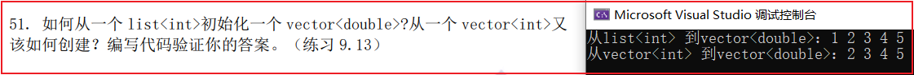

- 收获
  - 当容器类型不同，但元素类型相容时，可以使用范围初始化的方式进行初始化，例如这里的`list`和`vector`虽然不同，但是`double`是兼容`int`的，可以直接使用范围初始化

### 第五十二题

```c++
#include <iostream>
#include <vector>
#include <list>

using namespace std;

void Myprint(vector<string> v) {
	for (int i = 0; i < v.size(); i++) {
		cout << v[i] << " ";
	}
	cout << endl;
}

int main() {

	list<const char*> l = {"123", "234", "345"};
	vector<string> v(l.begin(), l.end());
	Myprint(v);


	return 0;
}
```

- 运行结果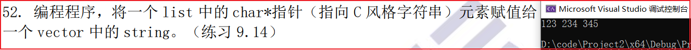

- 收获
  - 原理同第五十一题，但是利用字符指针指向字符串，只能读不能写，所以要用`const`进行修饰

### 第五十三题

```c++
#include <iostream>
#include <deque>
#include <string>

using namespace std;

void Myprint(deque<string> d) {
	for (deque<string>::iterator it = d.begin(); it != d.end(); it++) {
		cout << *it << " ";
	}
	cout << endl;
}

int main() {

	deque<string> d(5);

	cout << "请输入5个字符串用空格隔开：";
	for (int i = 0; i < 5; ++i) {
		cin >> d[i];
	}

	Myprint(d);

	return 0;
}
```

- 运行结果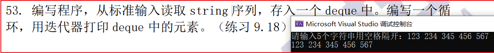

- 收获
  - `deque`相当于一个双端的数组，完全可以当作数组来用，并且比数组使用更方便

### 第五十四题

```c++
#include <iostream>
#include <vector>
#include <list>

using namespace std;

void MyPrint1(list<int> l) {
	for (list<int>::iterator it = l.begin(); it != l.end(); it++) {
		cout << *it << " ";
	}
	cout << endl;
}

void MyPrint2(vector<int> v) {

	for (vector<int>::iterator it = v.begin(); it != v.end(); ++it) {
		cout << *it << " ";
	}
	cout << endl;
}

int main() {

	list<int> l{1, 2, 3, 4, 5, 6, 7, 8, 9};
	vector<int> v1;//存放偶数
	vector<int> v2;//存放奇数
	for (list<int>::iterator it = l.begin(); it != l.end(); ++it) {
		if (*it % 2 == 0) {
			v1.push_back(*it);
		}
		else {
			v2.push_back(*it);
		}
	}

	cout << "打印list：";
	MyPrint1(l);

	cout << "打印存放偶数的v1：";
	MyPrint2(v1);

	cout << "打印存放奇数的v2：";
	MyPrint2(v2);

	return 0;
}c
```

- 运行结果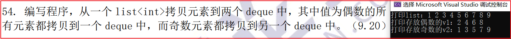

- 收获
  - 就是遍历一遍`list`容器，用条件语句进行筛选，分别把数据存入对应的容器中

### 第五十五题

```c++
#include <iostream>
#include <string>

using namespace std;


int main() {

	string s = "";
	s.reserve(100);//预先分配100个空间
	int capacity = 100;
	char c;
	cout << "请输入一个字符，输入字符0停止输入：";
	while (cin >> c) {
		if (c == '0') {
			cout << " 输入停止" << endl;
			break;
		}
		else {
			s += c;
		}

		//一次开辟多个空间
		if (s.size() >= capacity) {
			s.reserve(capacity + 100);
			capacity += 100;
		}
		cout << "请输入一个字符，输入字符0停止输入：";
	}
	cout << "最终字符串s为：" << s << endl;

	return 0;
}
```

- 运行结果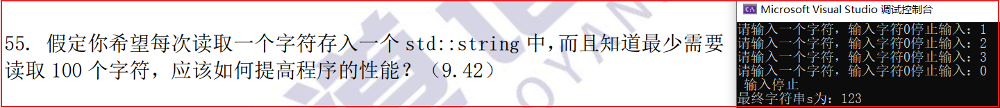

- 收获
  - 一次开辟一块空间，可以避免重复多次开辟空间并拷贝赋值带来开销

### 第五十六题

```c++
#include <iostream>
#include <string>

using namespace std;

string func(string &name, string prefix, string suffix) {
	
	name.insert(0, prefix);
	name.append(suffix);
	return name;
}

int main() {

	string name;
	cout << "请输入一个名字：";
	cin >> name;	
	func(name, "Mr.", "ABC");
	cout << "添加前缀和后缀的名字为：" << name << endl;

	return 0;
}
```

- 运行结果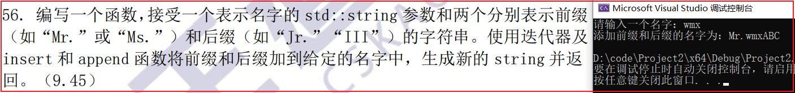

- 收获
  - 主要是了解`insert`函数和`append`函数的用法，这里
  - `name.insert(0, prefix)`表示在`name`字符串的第1个字符前面插入字符串`prefix`
  - `name.append(suffix)`;表示在`name`字符串后面追加字符串`suffix`

### 第五十七题

```c++
#include <iostream>
#include <map>
#include <string>
#include <vector>

using namespace std;

//打印操作
void Myprint(map<string, vector<string>> m) {
	for (map<string, vector<string>>::iterator it = m.begin(); it != m.end(); ++it) {
		cout << (*it).first << "家成员：";
		for (int i = 0; i < (*it).second.size(); ++i) {
			cout << (*it).second[i] << " ";
		}
		cout << endl;
	}
	cout << endl;
}


int main() {

	map<string, vector<string>> m;
	
	string surname;
	string temp;
	vector<string> name;
	cout << "请输入一个家庭的姓，输入字符0结束输入：";
	while (cin >> surname) {
		if (surname == "0") {
			break;
		}
		cout << "请给这个家庭添加新的孩子，输入字符0结束添加：";
		while (cin >> temp) {
			if (temp == "0") {
				break;
			}
			name.push_back(temp);
			cout << "请给这个家庭添加新的孩子，输入字符0结束添加：";
		}
		m.insert(make_pair(surname, name));
		name.clear();//清除上一下的数据，待下一次使用
		cout << "请输入一个家庭的姓，输入字符0结束输入：";
	}

	Myprint(m);

	return 0;
}
```

- 运行结果

  

- 收获
  - map容器，底层实现为二叉树，且内部每个元素是对组，对组中的第一个是键值，第二个是值。map容器不允许键值重复，且在插入过程中会按照键值自动排序

### 第五十八题

```c++
#include <iostream>
#include <vector>
#include <string>

using namespace std;

void MyPrint(vector<string> v) {
	for (int i = 0; i < v.size(); ++i) {
		cout << v[i] << " ";
	}
	cout << endl;
}

int main() {

	cout << "请输入一个单词，当输入字符0是停止输入：";
	string word;
	vector<string> v;
	bool flag = true;
	while (cin >> word) {

		if (word == "0") {
			break;
		}
		else {
			if (v.size() == 0) {
				v.push_back(word);
			}
			else {
				//检查是否重复
				for (int i = 0; i < v.size(); ++i) {
					//有重复的单词
					if (word == v[i]) {
						flag = false;
						break;
					}
				}
				if (flag == true) {
					v.push_back(word);
				}
				else {
					flag = true;
				}
			}
		}
		cout << "请输入一个单词，当输入字符0是停止输入：";
	}

	cout << "保存的不重复的单词为：";
	MyPrint(v);
}
```

- 运行结果


- 收获
  - `set`容器不允许插入重复的值，且会对插入的值自动进行排序，`set`这一特性天生可以解决这个问题，且不用多余的操作，而这里用`vector`每次插入时还需要从前到后检查是否有重复的值，时间复杂度很高，`set`底层是平衡二叉树，查找比较时的时间复杂度较低

### 第五十九题

```c++
#include <iostream>
#include <map>
#include <string>

using namespace std;

int main() {

	map<string, int> m1;
	m1.insert(make_pair("wmx", 100));
	m1.insert(make_pair("mxw", 99));
	int temp1 = m1["wmx"];
	cout << temp1 << "***" << endl;
	temp1 = m1["mxw"];
	cout << temp1 << "***" << endl;

	map<int, string> m2;
	m2.insert(make_pair(100, "111"));
	m2.insert(make_pair(99, "222"));

	string temp2 = m2[100];
	cout << temp2 << "***" << endl;
	temp2 = m2[99];
	cout << temp2 << "***" << endl;
	return 0;
}
```

- 运行结果

- `map`容器，可以用其对组的第一个值作为下标来访问`map`容器，返回的值时其对组的第二个类型

### 第六十题

```c++
#include <iostream>
#include <vector>
#include <cstdlib>
#include <ctime>

using namespace std;

void BubbleSort(vector<int>& v) {
	for (int i = 0; i < v.size() - 1; ++i) {
		for (int j = 0; j < v.size() - 1 - i; ++j) {
			if (v[j] > v[j + 1]) {
				int temp = v[j];
				v[j] = v[j + 1];
				v[j + 1] = temp;
			}
		}
	}
}

void MyPrint(vector<int>& v) {
	for (vector<int>::iterator it = v.begin(); it != v.end(); ++it) {
		cout << *it << ' ';
	}
	cout << endl << endl;
}

int main() {

	vector<int> v;
	srand((unsigned)time(NULL));

	//生成10个随机数，存放到vector容器中
	for (int i = 0; i < 9; ++i) {
		v.push_back(rand() % 20);
	}
	cout << "原数组数据：";
	MyPrint(v);

	BubbleSort(v);
	
	cout << "从小到大排序后：";
	MyPrint(v);

	return 0;
}
```

- 运行结果

- 收获
  - vector完全可以当作数组进行使用，而且比数组更加方便，可以动态扩容，且有`size()`方法可以得到数组的大小

### `STL`总结

- `STL`本质是用面向对象的类模板实现的，关键在于了解各个容器的特性
- `STL`其实和数据结构密不可分，其实就是一个个写好的数据结构，并提供了友好的结构，关键在于结合具体问题，去选择使用哪一个容器去解决问题，算法和语法的难度有本质的区别

## 说明

- 第`24`题的n皇后问题，以及第30题的约瑟夫环问题，这两个经典的算法，都不能很好的解决，只给出了示例代码

## 最后的总结

- 整体写下来的感觉，就是涉及一些算法的题目比纯语法的题目难很多。其实这些东西我之前都学过一遍，但是真正把每个代码的细微之处都把握好也不是那么容易的。感觉写代码和睡觉一样，不能急于求成，越想早点睡着就越睡不着，写代码也是一样，真正把代码的细节都理解清楚也不是很容易的，年轻人还得练。
